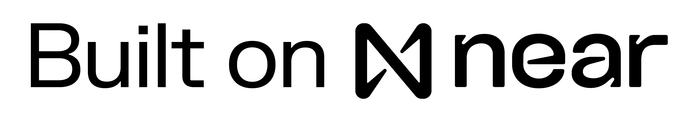
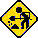

<span><a href="http://www.textfiles.com/underconstruction" align="center">

</a>

</span>
<p align="center" ><span style="font-size: 4em;">
  everything
  </span><span style="font-size: 2em;">
  core
</span>
</p>




## Installation

Install packages from root directory. This monorepo uses pnpm workspaces.

```bash
pnpm i
```

## Development

```bash
pnpm run dev
```

This will open the gateway at localhost:3000 and uses [near social local viewer](https://github.com/wpdas/near-social-local-viewer) to hot reload widgets at localhost:3005.


---

## Structure

### - [apps/gateway](./apps/gateway/README.md)

React App that handles navigation, login, and uses the VM to render widgets. Mostly derrived from  Mostly derived from [near-discovery](https://github.com/near/near-discovery)

### - [packages/vm](./packages/vm/README.md)

[NearSocial/VM](https://github.com/NearSocial/VM) ~ Library that acts like a compiler for text files stored on blockchain. Mostly derived from original with custom keywords "Type" and "Masonry".

### - [/widgets](./widgets/)

[Everything](./widgets/Everything.jsx) - main page

[Everything.Things](./widgets/Everything.Things.jsx) - Masonry of things

[Everything.Create.Thing](./widgets/Everything.Create.Thing) - "the backend" of a thing's creator app via [near social bridge](https://github.com/wpdas/near-social-bridge)

[Everything.Summary.Thing](./widgets/Everything.Summary.Thing) - wrapper for a type's summary widget

[Everything.View.Thing](./widgets/Everything.View.Thing) - wrapper for a type's view widget

### - [api/mesh](./api/mesh/README.md)

[GraphQL mesh](https://the-guild.dev/graphql/mesh) used for accessing and creating off-chain data.


## Contributing

<a href="http://www.textfiles.com/underconstruction">
<span>



</span>
</a>
